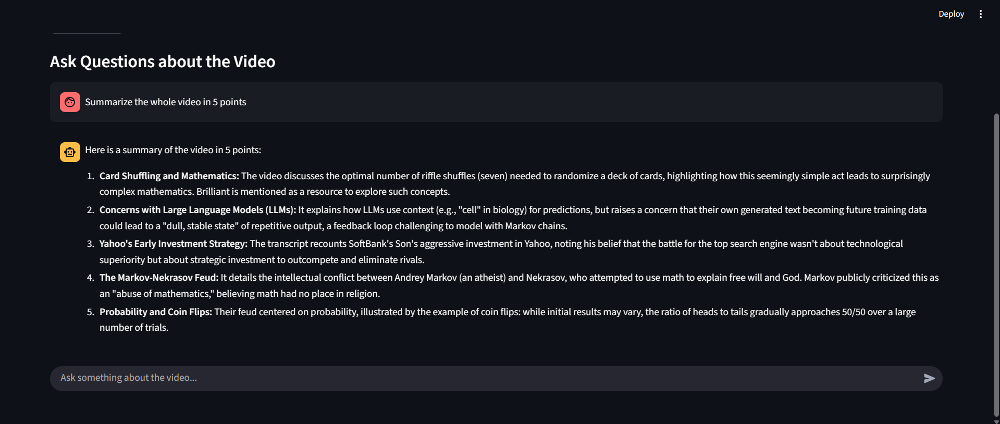
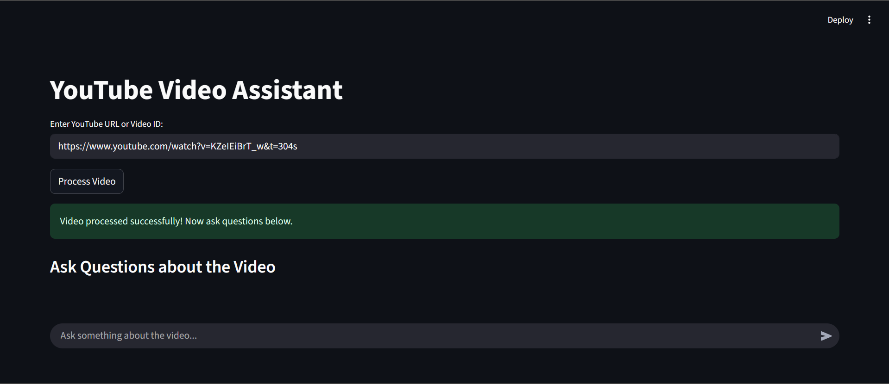

#  Vidsage – Smart YouTube Video Assistant




Vidsage is an AI-powered tool made through LangChain that allows you to extract transcripts from YouTube videos, split them into chunks, embed them using Google Generative AI embeddings, and store them in a FAISS vector database.
You can then ask natural language questions about the video, and Vidsage retrieves the most relevant context and provides concise, accurate answers.

---

## Features
- Fetch YouTube video transcripts automatically
- Split transcripts into manageable chunks using LangChain text splitter
- Generate embeddings with Google Generative AI
- Store and query embeddings using FAISS vector database and retreiver
- Ask questions about any YouTube video and get AI-powered answers

---

## Installation

### 1. Clone the repository
```bash
git clone https://github.com/your-username/your-repo.git
cd your-repo
```
### 2. Create a virtual environment
```bash
python -m venv venv
source venv/bin/activate   # for Mac/Linux
venv\Scripts\activate      # for Windows
```
### 3. Install dependencies
```bash
pip install -r requirements.txt
```
### 4. Set up environment variables
```bash
GOOGLE_API_KEY=your_api_key_here
```
## Link
- [Streamlit](https://vidsage.streamlit.app/)


